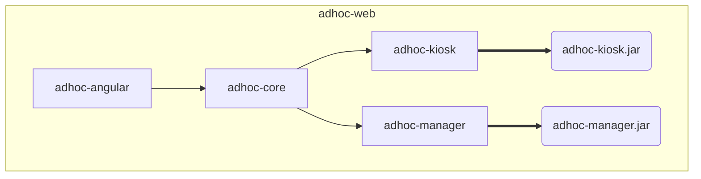

# Adhoc Web

Web code for Adhoc (final name to be decided).

[https://github.com/SpeculativeCoder/adhoc-web](https://github.com/SpeculativeCoder/adhoc-web) 
[https://github.com/SpeculativeCoder/AdhocPlugin](https://github.com/SpeculativeCoder/AdhocPlugin) 
[https://github.com/SpeculativeCoder/AdhocDocumentation](https://github.com/SpeculativeCoder/AdhocDocumentation) 

This is a work in progress, experimental, and subject to major changes.

The eventual ideal/goal of Adhoc is to be a system for running a multi-user, multi-server 3D world in the cloud (e.g. AWS) using Unreal Engine with the HTML5 ES3 (WebGL2) platform plugin.

Live Example: [**AdhocCombat** (https://adhoccombat.com)](https://adhoccombat.com) - work in progress

## Contents

- [adhoc-angular](adhoc-angular) - Angular (TypeScript) frontend.
- [adhoc-core](adhoc-core) - Spring Boot (Java) core/common backend functionality.
- [adhoc-kiosk](adhoc-kiosk) - Spring Boot (Java) "kiosk" backend which only provides functionality for normal users.
- [adhoc-manager](adhoc-manager) - Spring Boot (Java) "manager" backend which manages the Unreal servers and provides functionality for admin users in addition to normal users.

Most of the time there will be at least one manager running. More kiosks can be added as necessary to handle more normal users if demand is high enough.

## Usage

Out of the box, the application in this repository will run in a development mode without the Unreal / cloud server functionality.

### Run in IDE

To build the application (at least once to make sure the Angular app is built):

`mvn clean package -DskipTests`

You can then run this Spring Boot application class in your IDE: `AdhocManagerApplication`

If you go to http://localhost you should see the manager application running in development mode.

Further functionality requires setup. See: [https://github.com/SpeculativeCoder/AdhocDocumentation](https://github.com/SpeculativeCoder/AdhocDocumentation)

### Run from command line

`mvn clean install -DskipTests`

`mvn spring-boot:run -f adhoc-manager`

## Copyright / License(s)

Copyright (c) 2022-2026 SpeculativeCoder (https://github.com/SpeculativeCoder)

[LICENSE](LICENSE) (**MIT License**) applies to the files in this repository unless otherwise indicated.

There are currently some files under a different license (indicated in the file and with license provided in adjacent *.LICENSE file):

- [AdhocColorLogbackConverter](adhoc-core/src/main/java/adhoc/system/logging/logback/AdhocLogbackColorConverter.java) is a modified version of the Spring Boot ColorConverter - subject to **[Apache License, Version 2.0](adhoc-core/src/main/java/adhoc/system/logging/logback/AdhocLogbackColorConverter.java.LICENSE)**
- [00-91-changelog-spring-session.xml](adhoc-core/src/main/resources/db/changelog/0000/00/00-91-changelog-spring-session.xml) uses SQL from Spring Session which is subject to **[Apache License, Version 2.0](adhoc-core/src/main/resources/db/changelog/0000/00/00-91-changelog-spring-session.xml.LICENSE)**
- [00-95-changelog-quartz.xml](adhoc-core/src/main/resources/db/changelog/0000/00/00-95-changelog-quartz.xml) uses SQL from Quartz Scheduler which is subject to **[Apache License, Version 2.0](adhoc-core/src/main/resources/db/changelog/0000/00/00-95-changelog-quartz.xml.LICENSE)**
